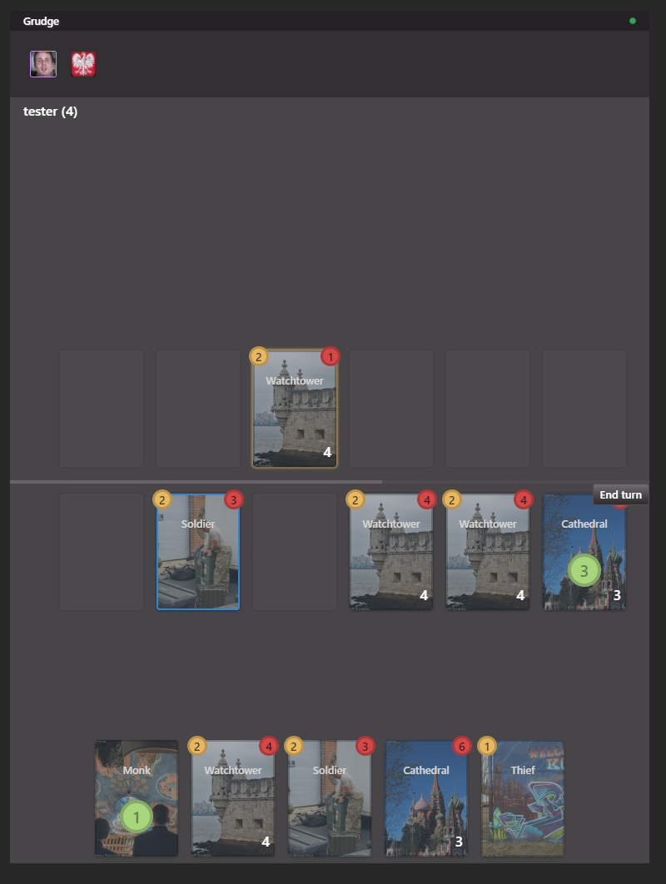

# Grudge

Multiplayer deck building game built on socket.io and react.



## Setup

```
$ npm install
$ npm run bootstrap
$ npm run dev
```

## Deployment

```
$ git push heroku
```

## HTTPS locally

1. Set `PROTOCOL=https` in `@grudge/server/.env` or `@grudge/server/config/development.js`
2. Generate a certificate and key with `npm run generate-ssl`
3. Trust the self-signed certificate (This step depend on your operating system)
4. Restart the server `npm start`
